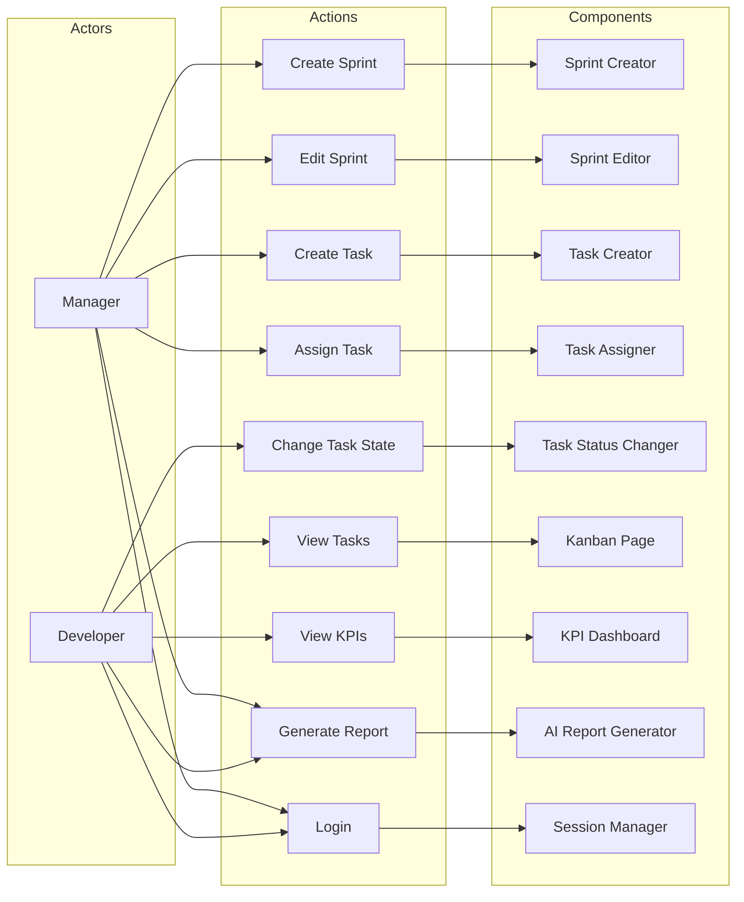
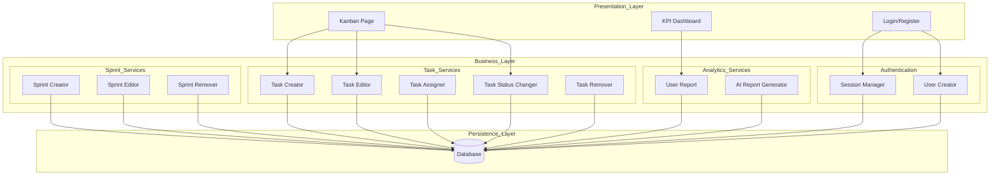
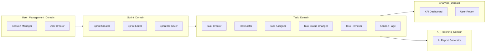

# Architecture Design Deliverable

# Component Identification Process and Rationale

For component identification, the Actions/Actors Approach was selected.

This methodology was chosen because it establishes a direct relationship between users of the system and the operations they perform. By identifying the actors and their interactions with the application, it becomes easier to derive candidate components and determine their responsibilities.

The identification process followed these steps:

1. Identify system actors.
2. Identify actions performed by each actor.
3. Associate actions with candidate components.
4. Assign responsibilities to each component.
5. Refine the components considering requirements and quality attributes.

The following actors were identified:

- Manager
- Developer

The following actions were identified:

- Create Sprint
- Edit Sprint
- Delete Sprint
- Create Task
- Assign Task
- Change Task State
- View Tasks
- View KPIs
- Generate AI Reports
- Login
- Register User
- Logout
- View User Statistics

The identified actions were grouped according to their responsibilities and converted into system components.

---

# Flow Diagram

---

# Component Table

| Actor | Event/Action | Component | Responsibilities |
|----------|----------|----------|----------|
| Manager | Create Sprint | Sprint Creator | Creates project sprints |
| Manager | Edit Sprint | Sprint Editor | Modifies sprint attributes |
| Manager | Delete Sprint | Sprint Remover | Removes project sprints |
| Manager | Create Task | Task Creator | Creates tasks associated with a sprint |
| Manager, Developer | Edit Task | Task Editor | Modifies task attributes |
| Manager | Assign Task | Task Assigner | Assigns responsible developers |
| Manager, Developer | Change Task State | Task Status Changer | Updates task progress |
| Manager | Delete Task | Task Remover | Removes tasks |
| Manager, Developer | View Tasks | Kanban Page | Displays tasks using Kanban visualization |
| Manager, Developer | View KPIs | KPI Dashboard | Displays project metrics and graphical KPIs |
| Manager, Developer | Generate Report | AI Report Generator | Sends requests to external AI for report generation |
| Manager, Developer | Login | Session Manager | Authenticates users and creates sessions |
| Manager, Developer | Register User | User Creator | Creates new users |
| Manager, Developer | Logout | Session Manager | Closes user sessions |
| Manager, Developer | View User Statistics | User Report | Displays productivity metrics |

---

# Technical Partitioning

---

# Domain Partitioning

