# ForgeTask – Guía de Usuario

> **¿Qué es ForgeTask?**  
> Es una herramienta diseñada para ayudarte a gestionar proyectos y tareas de manera visual y sencilla. Funciona como un administrador de proyectos interactivo (similar a Trello o Jira), permitiéndote colaborar con tu equipo, asignar fechas límite y darle seguimiento a todo tu trabajo a través de una página web o desde Telegram.

---

## Tabla de Contenidos

1. [Información general](#1-información-general)
2. [Requisitos previos](#2-requisitos-previos)
3. [Primeros pasos (Quick Start)](#3-primeros-pasos-quick-start)
4. [Conceptos clave](#4-conceptos-clave)
5. [Uso de la Aplicación Web](#5-uso-de-la-aplicación-web)
   - [5.1 Crear un Sprint (Ciclo de trabajo)](#51-crear-un-sprint-ciclo-de-trabajo)
   - [5.2 Crear y mover tareas](#52-crear-y-mover-tareas)
   - [5.3 Generar reportes con Inteligencia Artificial](#53-generar-reportes-con-inteligencia-artificial)
   - [5.4 Filtrar tareas](#54-filtrar-tareas)
   - [5.5 Invitar a tu equipo al proyecto](#55-invitar-a-tu-equipo-al-proyecto)
6. [Uso del Chatbot en Telegram](#6-uso-del-chatbot-en-telegram)
   - [6.1 Ingresar al chatbot](#61-ingresar-al-chatbot)
   - [6.2 Crear una nueva tarea desde Telegram](#62-crear-una-nueva-tarea-desde-telegram)
   - [6.3 Listar todas las tareas](#63-listar-todas-las-tareas)
7. [Solución de problemas comunes](#7-solución-de-problemas-comunes)
8. [Preguntas frecuentes (FAQ)](#8-preguntas-frecuentes-faq)

---

## 1. Información general

- **Versión de la app:** `v2.0.0`  
- **Última actualización:** `2026-05-27`  

## 2. Requisitos previos

Para utilizar ForgeTask solo necesitas:

1. Un navegador web moderno (Google Chrome, Firefox, Edge, etc.).
2. Conexión a Internet estable.
3. Si deseas usar el asistente móvil, tener la aplicación de **Telegram** instalada en tu teléfono o computadora.

## 3. Primeros pasos (Quick Start)

Sigue nuestra guía rápida de 5 minutos para empezar:

1. Ingresa a la plataforma desde tu navegador: `http://forgetask.gl1tchcore.tech/` o `http://159.54.154.154/login`.
2. Si no tienes cuenta, haz clic en **Regístrate gratis**. Si ya la tienes, inicia sesión.
3. Si eres usuario nuevo, la plataforma te guiará con unas sencillas preguntas para configurar tu primer proyecto.
4. Haz clic en el botón **New Task** (Nueva Tarea) en la parte superior derecha para crear tu primera actividad y asígnatela.
5. Verás tu nueva tarjeta en el panel (Kanban). ¡Puedes arrastrarla y soltarla para cambiar su estado!

> **Pro-Tip:** Configura primero a los miembros de tu equipo (ver sección de invitaciones) y tus periodos de trabajo (Sprints) para sacarle el máximo provecho desde el inicio.

## 4. Conceptos clave

- **Web App:** Es la página principal donde ves tu tablero visualmente (`http://forgetask.gl1tchcore.tech/`).
- **Chatbot (Telegram):** Es un asistente virtual en Telegram (`@cloudforge_oci_chatbot_bot`) que permite hacer casi todo lo de la web, pero enviándole simples mensajes de chat.
- **Sprint:** Es un periodo de tiempo (ej. una semana) en donde tú y tu equipo se comprometen a terminar ciertas tareas.
- **Kanban / Tablero:** Es la vista donde se ven tus tareas como "tarjetas" clasificadas en columnas ("Por hacer", "En progreso", "Terminado").

## 5. Uso de la Aplicación Web

### 5.1 Crear un Sprint (Ciclo de trabajo)
1. Inicia sesión y ve a tu proyecto.
2. En la parte superior derecha, haz clic en el botón **Check Sprint**.
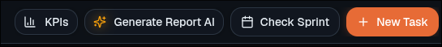
3. En la ventana emergente, completa las fechas y los detalles de tu periodo de trabajo.
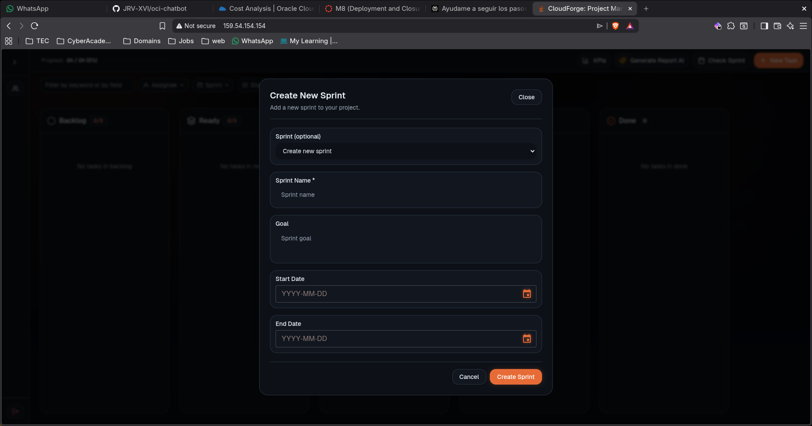 
4. Haz clic en **Create Sprint** para guardarlo.

### 5.2 Crear y mover tareas
1. En la parte superior derecha de tu tablero, haz clic en **New Task**.

2. Llena los detalles sobre lo que hay que hacer (título, descripción, responsable, etc.).
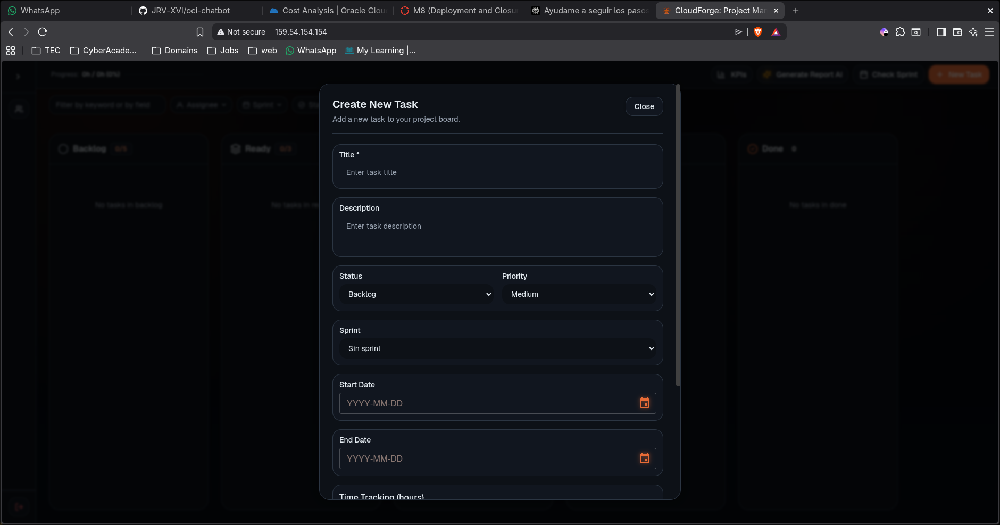
3. Haz clic en **Create Task**.
4. ¡Listo! Tu tarea aparecerá en el tablero. Haz clic en ella sin soltar para arrastrarla de una columna a otra a medida que vayas avanzando.
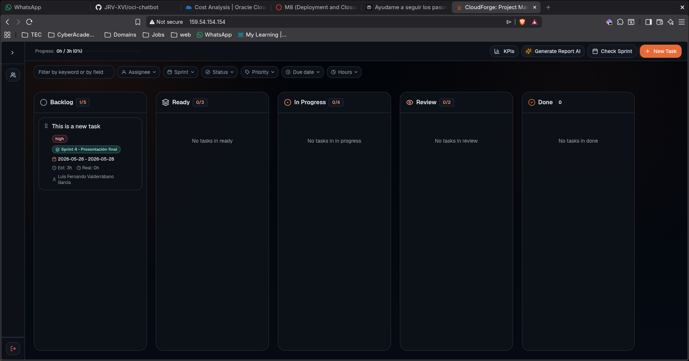

### 5.3 Generar reportes con Inteligencia Artificial
1. Abre tu proyecto en el navegador.
2. Ve a la parte superior y haz clic en el botón **Generate Report AI**.

3. De inmediato se descargará un archivo PDF; ábrelo y encontrarás un reporte ejecutivo fácil de leer incluyendo sugerencias creadas por nuestra IA.

### 5.4 Filtrar tareas
Si tu equipo creó muchísimas tareas, ubica los botones de abajo de la barra de progreso (superior). Al presionarlos, la vista ocultará lo que no necesites ver para dejar la pantalla más despejada.
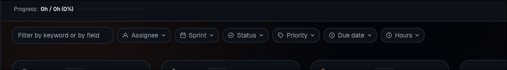

### 5.5 Invitar a tu equipo al proyecto
1. En el menú gris del lado izquierdo, elige la sección **Members** (Miembros).
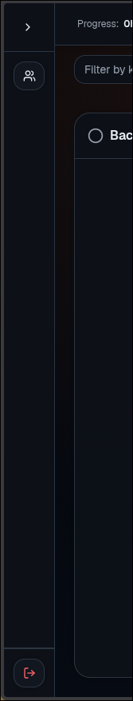
2. Haz clic en el botón **Invite** (Invitar) dentro de ese panel.
3. Rellena los correos y elige el Rol: Organizador (Manager) o Desarrollador (Developer).
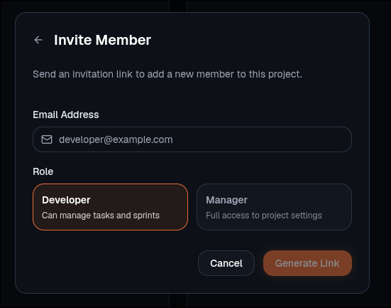
4. La plataforma te creará un Link. Cópialo y compártelo directo con tus compañeros; cuando le hagan clic se agregaran de manera automática.

## 6. Uso del Chatbot en Telegram

### 6.1 Ingresar al chatbot
1. Abre tu aplicación de Telegram en tu celular o computadora.
2. En la barra de búsqueda de chats, escribe `CloudForge OCI Chatbot`.
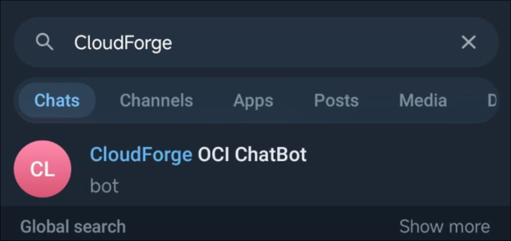
3. Presiona el botón verde **Start Bot** (Iniciar) al final de la pantalla para encenderlo.

### 6.2 Crear una nueva tarea desde Telegram
1. En el menú interactivo del bot en telegram, selecciona **Add New Item**.
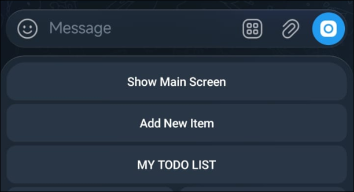
2. El bot te hará las preguntas y solo tendrás que escribir como si conversaras por un chat. 

### 6.3 Listar todas las tareas
1. Despliega el menú o escribe literalmente **List All Items**.
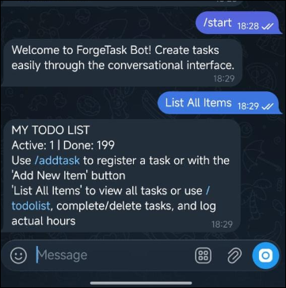
2. Recibirás tu lista de pendientes sin necesidad de entrar a la web.

## 7. Solución de problemas comunes

**El chatbot se quedó "trabado" o arroja un error raro:**
- Ve a los tres puntos (arriba a la derecha del chat en Telegram), elige **Clear history** (Vaciar chat) y escribe `/start`.
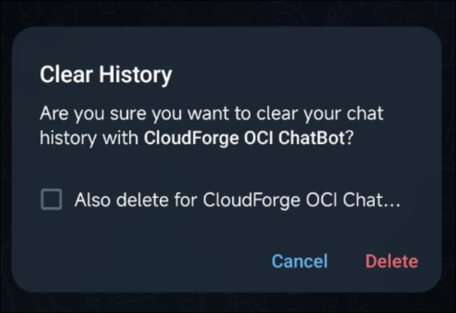
- Si esto no funciona, ocupa la opción de **Delete chat** y vuelve a buscar el bot por su nombre.
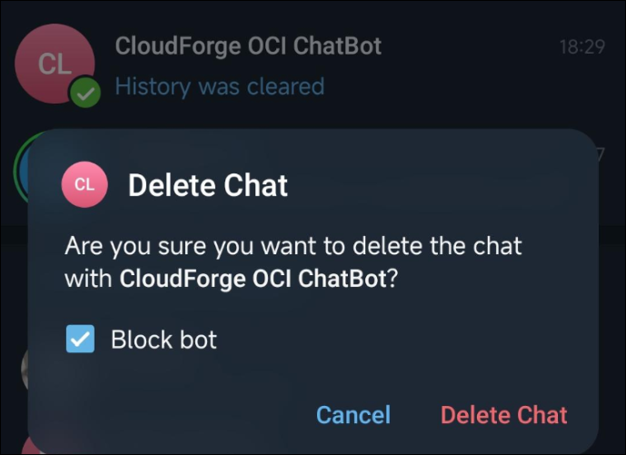

**La página de internet no quiere cargar el tablero:**
- Confirma tu Wi-Fi.
- Refresca presionando F5 o cierra tu cuenta temporalmente y vuelve a abrir sesión.

## 8. Preguntas frecuentes (FAQ)

- **¿Esto solo le sirve a programadores/developers?**  
  ¡Para nada! Aunque usamos el término "Developer" por costumbre de TI, cualquier grupo que necesite delegar trabajo de equipos con control de tiempos puede aprovechar la herramienta.
  
- **¿Es seguro usar Telegram, guardan todo lo que digo?**  
  Tus datos de ForgeTask viajan de manera privada gracias a la infraestructura de Oracle. El bot de Telegram no guarda conversaciones, solo lee los botones y comandos relacionados con ForgeTask.

- **¿Qué hago si falla un botón?**  
  Por favor contáctanos directamente o eleva el problema para que el sistema TI lo revise de cerca.

---

> **Feedback y mejora de la guía:**  
Si te diste cuenta que un texto de este instructivo está atrasado o se puede mejorar, puedes abrir un "issue" en este repositorio en GitHub, marcándolo con la bandera `documentation`.
