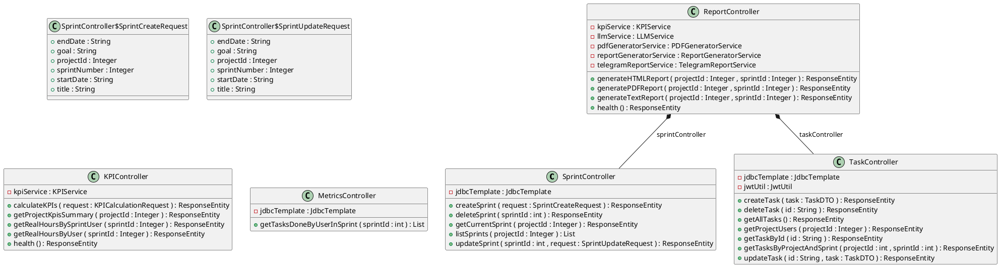
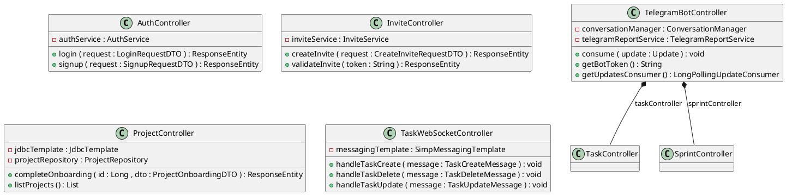
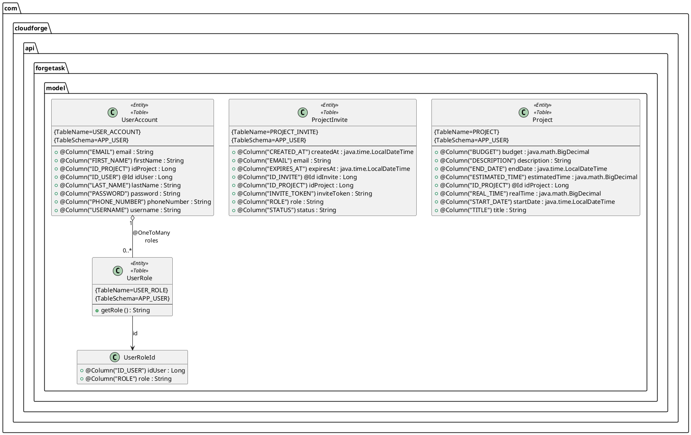
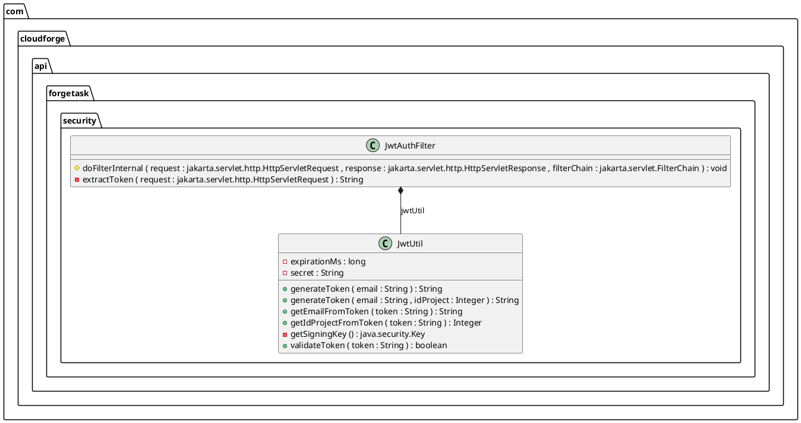
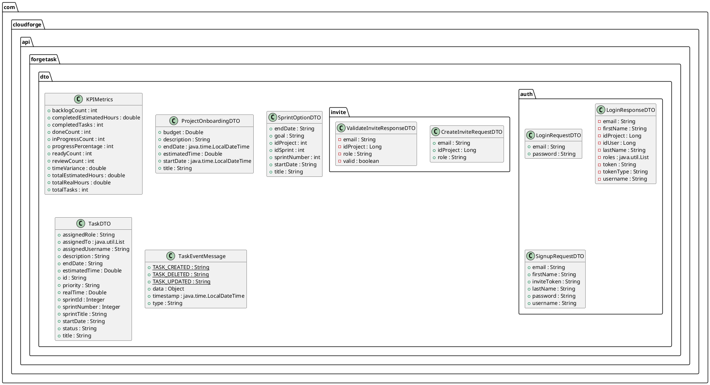

# C4 Level 4 — Code Diagrams

Diagramas de clases generados automáticamente desde el código fuente Java del backend de **Forgetask**.  
Generados por el plugin `plantuml-generator-maven-plugin` vía GitHub Actions en cada push a `main`.

> **Para visualizar los diagramas:** Instala la extensión [PlantUML for GitHub](https://chromewebstore.google.com/detail/plantuml-for-github) en Chrome o Firefox. Los bloques de código se renderizarán automáticamente al abrir esta página.

---

## ¿Qué es el C4 Level 4?

El modelo C4 describe la arquitectura de software en cuatro niveles de detalle creciente:

| Nivel | Nombre | ¿Qué muestra? |
|-------|--------|---------------|
| C1 | System Context | El sistema y sus usuarios |
| C2 | Containers | Las aplicaciones que componen el sistema (frontend, backend, base de datos) |
| C3 | Components | Los módulos internos de cada container |
| **C4** | **Code** | **Las clases Java que implementan cada componente** |

Este documento contiene el **Level 4**: los diagramas de clases reales del backend de Forgetask, organizados por capa técnica. Son la evidencia más concreta de cómo está construido el sistema — no son un diseño aspiracional, sino una fotografía del código tal como existe hoy.

---

## Cómo leer estos diagramas

Cada caja representa una **clase Java**. Dentro de la caja encontrarás:

- **Campos** (atributos): precedidos de `+` (público), `-` (privado) o `#` (protegido)
- **Métodos**: también con su visibilidad y los tipos de sus parámetros y retorno
- **Relaciones entre clases**: las flechas indican dependencias. `*--` significa composición (una clase contiene a la otra). `-->` significa asociación (una clase referencia a la otra)

---

## 1a. Controllers — Negocio (Sprint, Task, KPI, Report)

### ¿Qué muestra este diagrama?

Las clases Java que exponen los endpoints REST relacionados con la lógica de negocio principal de Forgetask: gestión de sprints, tareas, métricas de productividad y generación de reportes.

### ¿Por qué es importante comprenderlo?

Los Controllers son la **puerta de entrada** de toda petición HTTP que llega desde el frontend. Entender este diagrama permite saber exactamente qué operaciones expone la API y cómo están organizadas. Por ejemplo:

- `SprintController` expone los endpoints para crear, listar, actualizar y eliminar sprints. Internamente define clases auxiliares (`SprintCreateRequest`, `SprintUpdateRequest`) que representan el cuerpo de cada petición — esto muestra que la validación de datos de entrada ocurre a nivel de controller antes de llegar al service.
- `TaskController` es el controller más complejo del sistema: gestiona el ciclo de vida completo de una tarea. Tiene acceso directo a `JdbcTemplate` (consultas SQL manuales) y a `JwtUtil` (para extraer el usuario del token y saber a qué proyecto pertenece).
- `ReportController` orquesta cuatro servicios diferentes (`KPIService`, `LLMService`, `PDFGeneratorService`, `ReportGeneratorService`) para generar reportes en tres formatos: texto, HTML y PDF. La flecha de composición `*--` hacia `SprintController` y `TaskController` indica que reutiliza esos controllers directamente para obtener datos — un patrón inusual que refleja una decisión de diseño pragmática.
- `KPIController` es el endpoint del dashboard de métricas. Sus métodos muestran exactamente qué métricas calcula el sistema: distribución de tareas, horas reales por usuario, resumen de KPIs por proyecto.

---

## 1b. Controllers — Infraestructura (Auth, Invite, Project, WebSocket, Telegram)

### ¿Qué muestra este diagrama?

Las clases Java que gestionan los aspectos de infraestructura del sistema: autenticación de usuarios, sistema de invitaciones, gestión de proyectos, comunicación en tiempo real por WebSocket y el bot de Telegram.

### ¿Por qué es importante comprenderlo?

Este diagrama muestra la **capa de acceso al sistema**. Sin estos controllers, ningún usuario podría entrar ni recibir notificaciones en tiempo real:

- `AuthController` es el punto de entrada de todos los usuarios. Solo tiene dos métodos: `login` y `signup`. Su simplicidad es intencional — delega toda la lógica a `AuthService`, siguiendo correctamente el principio de separación de responsabilidades.
- `InviteController` implementa el flujo de invitación a proyectos. `createInvite` genera un token de invitación y `validateInvite` lo verifica cuando el usuario acepta. Este mecanismo garantiza que solo usuarios invitados explícitamente puedan unirse a un proyecto.
- `TaskWebSocketController` gestiona la comunicación en tiempo real. Cuando un usuario crea, actualiza o elimina una tarea, este controller broadcast el evento a todos los clientes conectados vía WebSocket — así el Kanban se actualiza en vivo sin que nadie tenga que recargar la página.
- `TelegramBotController` implementa el bot de Telegram. Su método `consume` recibe cada mensaje que llega al bot. Las flechas de composición hacia `TaskController` y `SprintController` revelan que el bot tiene acceso completo a la API interna del sistema para responder consultas sobre tareas y sprints.

---

## 2. Services — Business Logic

### ¿Qué muestra este diagrama?

Las clases Java que contienen la lógica de negocio del backend: cálculo de KPIs, integración con IA, generación de reportes en PDF, envío de reportes por Telegram, autenticación e invitaciones.

### ¿Por qué es importante comprenderlo?

Los Services son el **núcleo del sistema**. Es donde vive la inteligencia de Forgetask — no solo el acceso a datos, sino las reglas, los cálculos y las integraciones:

- `KPIService` es el motor de métricas. Sus métodos `calculateKPIs` reciben una lista de tareas y devuelven un objeto `KPIMetrics` con todos los indicadores calculados. El hecho de que tenga dos versiones del mismo método (con y sin `expectedTaskCounts`) muestra que soporta tanto cálculos simples como análisis comparativos donde se esperaba un número específico de tareas.
- `LLMService` es la integración con el modelo de lenguaje externo (IA). `generateText` envía un prompt y devuelve la respuesta textual. `isConfigured` permite que el sistema funcione de forma degradada si no hay API key configurada — un ejemplo de diseño resiliente.
- `ReportGeneratorService` orquesta la generación del reporte de gestión. Sus dependencias `*--` con `KPIService` y `LLMService` muestran la cadena: primero calcula métricas, luego pide a la IA que redacte el análisis narrativo, y finalmente ensambla el reporte.
- `PDFGeneratorService` convierte el contenido del reporte a un archivo PDF binario (`[B` en Java significa `byte[]`). Sus dos versiones de `generatePDF` permiten generar PDFs simples o enriquecidos con métricas y tabla de horas por usuario.
- `SprintEmbeddingService` y `VectorContextRetriever` son la infraestructura de búsqueda semántica: indexan el contenido de los sprints para que la IA pueda recuperar contexto relevante de sprints anteriores al generar reportes.
- `TelegramReportService` genera y envía el reporte completo directamente a un chat de Telegram, combinando `ReportGeneratorService` y `PDFGeneratorService`.

```plantuml
@startuml

class com.cloudforge.api.forgetask.service.KPIService {
	{field} -jdbcTemplate : org.springframework.jdbc.core.JdbcTemplate
	{method} +calculateKPIs ( tasks : java.util.List ) : com.cloudforge.api.forgetask.dto.KPIMetrics
	{method} +calculateKPIs ( tasks : java.util.List , expectedTaskCounts : java.util.Map ) : com.cloudforge.api.forgetask.dto.KPIMetrics
	{method} +getProjectKpisSummary ( projectId : Integer ) : com.cloudforge.api.forgetask.dto.ProjectKpisSummaryDTO
	{method} +getRealHoursBySprintUser ( sprintId : Integer ) : java.util.List
	{method} +getRealHoursByUser ( sprintId : Integer ) : java.util.List
	{method} +getRealHoursTasksByUser ( username : String , sprintId : Integer ) : java.util.List
	{method} +getTaskDistributionByStatus ( tasks : java.util.List ) : java.util.Map
	{method} +getTimeMetricsSummary ( tasks : java.util.List ) : java.util.Map
}


class com.cloudforge.api.forgetask.service.LLMService {
	{field} -llmConfig : com.cloudforge.api.forgetask.config.LLMConfig
	{field} {static} -logger : org.slf4j.Logger
	{field} -restTemplate : org.springframework.web.client.RestTemplate
	{method} +generateText ( prompt : String ) : String
	{method} +isConfigured () : boolean
}


class com.cloudforge.api.forgetask.service.PDFGeneratorService {
	{field} {static} -logger : org.slf4j.Logger
	{method} +generateFilename ( projectId : Integer , sprintId : Integer ) : String
	{method} +generatePDF ( reportContent : String , projectId : Integer , sprintId : Integer ) : [B
	{method} +generatePDF ( reportContent : String , projectId : Integer , sprintId : Integer , metrics : java.util.Map , userHours : java.util.List ) : [B
}


class com.cloudforge.api.forgetask.service.ReportGeneratorService {
	{field} {static} -logger : org.slf4j.Logger
	{method} +generateManagementReport ( projectId : Integer , sprintId : Integer , tasks : java.util.List ) : String
	{method} +generateManagementReport ( projectId : Integer , sprintId : Integer , tasks : java.util.List , userHours : java.util.List ) : String
}


class com.cloudforge.api.forgetask.service.SprintChunkBuilder {
	{field} -jdbcTemplate : org.springframework.jdbc.core.JdbcTemplate
	{field} {static} -logger : org.slf4j.Logger
	{method} +buildSprintChunk ( idSprint : int ) : String
}


class com.cloudforge.api.forgetask.service.SprintEmbeddingService {
	{field} -jdbcTemplate : org.springframework.jdbc.core.JdbcTemplate
	{field} {static} -logger : org.slf4j.Logger
	{method} +indexSprint ( idSprint : int , idProject : int , sprintTitle : String ) : void
}


class com.cloudforge.api.forgetask.service.TelegramReportService {
	{field} {static} -logger : org.slf4j.Logger
	{field} -sprintController : com.cloudforge.api.forgetask.controller.SprintController
	{field} -taskController : com.cloudforge.api.forgetask.controller.TaskController
	{method} +generateAndSendReport ( chatId : long , projectId : Integer , sprintId : Integer , telegramClient : org.telegram.telegrambots.meta.generics.TelegramClient ) : void
}


class com.cloudforge.api.forgetask.service.VectorContextRetriever {
	{field} -jdbcTemplate : org.springframework.jdbc.core.JdbcTemplate
	{field} {static} -logger : org.slf4j.Logger
	{field} -topK : int
	{method} +retrieveSprintContext ( queryText : String , excludeSprintId : int , idProject : int ) : java.util.List
}


class com.cloudforge.api.forgetask.service.auth.AuthService {
	{field} -jwtUtil : com.cloudforge.api.forgetask.security.JwtUtil
	{field} -passwordEncoder : org.springframework.security.crypto.password.PasswordEncoder
	{field} -projectRepository : com.cloudforge.api.forgetask.repository.ProjectRepository
	{field} -userRepo : com.cloudforge.api.forgetask.repository.UserAccountRepository
	{field} -userRoleRepository : com.cloudforge.api.forgetask.repository.UserRoleRepository
	{method} +login ( request : com.cloudforge.api.forgetask.dto.auth.LoginRequestDTO ) : com.cloudforge.api.forgetask.dto.auth.LoginResponseDTO
	{method} +signup ( request : com.cloudforge.api.forgetask.dto.auth.SignupRequestDTO ) : com.cloudforge.api.forgetask.dto.auth.LoginResponseDTO
}


class com.cloudforge.api.forgetask.service.invite.InviteService {
	{field} -inviteRepo : com.cloudforge.api.forgetask.repository.ProjectInviteRepository
	{method} +consumeInvite ( token : String ) : com.cloudforge.api.forgetask.model.ProjectInvite
	{method} +createInvite ( request : com.cloudforge.api.forgetask.dto.invite.CreateInviteRequestDTO ) : String
	{method} +validateToken ( token : String ) : com.cloudforge.api.forgetask.dto.invite.ValidateInviteResponseDTO
}

com.cloudforge.api.forgetask.service.ReportGeneratorService *--  com.cloudforge.api.forgetask.service.KPIService : kpiService
com.cloudforge.api.forgetask.service.ReportGeneratorService *--  com.cloudforge.api.forgetask.service.LLMService : llmService
com.cloudforge.api.forgetask.service.SprintEmbeddingService *--  com.cloudforge.api.forgetask.service.SprintChunkBuilder : chunkBuilder
com.cloudforge.api.forgetask.service.TelegramReportService *--  com.cloudforge.api.forgetask.service.PDFGeneratorService : pdfGeneratorService
com.cloudforge.api.forgetask.service.TelegramReportService *--  com.cloudforge.api.forgetask.service.ReportGeneratorService : reportGeneratorService
com.cloudforge.api.forgetask.service.auth.AuthService *--  com.cloudforge.api.forgetask.service.invite.InviteService : inviteService

@enduml
```

---

## 3. Models — JPA Entities

### ¿Qué muestra este diagrama?

Las clases Java anotadas con `@Entity` que se mapean directamente a tablas en Oracle DB. Cada campo anotado con `@Column` corresponde exactamente a una columna en la base de datos.

### ¿Por qué es importante comprenderlo?

Este diagrama es el **esquema de la base de datos expresado en código**. Entenderlo permite saber cómo está estructurada la persistencia del sistema sin necesidad de acceder a Oracle directamente:

- `UserAccount` representa a cada usuario registrado en el sistema. El campo `idProject` directamente en el usuario indica que en Forgetask cada usuario pertenece a un único proyecto — una decisión de diseño que simplifica las consultas pero limita la multi-tenancy.
- `UserRole` implementa los roles del sistema (`MANAGER`, `DEVELOPER`). La relación `@OneToMany` desde `UserAccount` significa que un usuario puede tener múltiples roles. `UserRoleId` es una clave compuesta (idUser + role) que identifica de forma única cada asignación de rol.
- `Project` almacena los metadatos del proyecto: título, descripción, fechas, presupuesto y tiempo estimado vs real. El campo `realTime` junto a `estimatedTime` permite calcular la varianza de tiempo a nivel de proyecto completo.
- `ProjectInvite` implementa el sistema de invitaciones. Los campos `inviteToken`, `expiresAt` y `status` muestran que las invitaciones tienen tiempo de expiración y estados (`PENDING`, `ACCEPTED`, `EXPIRED`), lo cual es un mecanismo de seguridad robusto.

---

## 4. Security — JWT Authentication

### ¿Qué muestra este diagrama?

Las dos clases Java que implementan el mecanismo de autenticación basado en JWT (JSON Web Tokens): el filtro que intercepta cada request y la utilidad que gestiona los tokens.

### ¿Por qué es importante comprenderlo?

Este diagrama muestra **cómo el sistema protege todos sus endpoints**. Es pequeño pero crítico — sin estas dos clases, cualquier petición HTTP podría acceder a cualquier recurso sin restricción:

- `JwtUtil` es la clase que sabe todo sobre los tokens. `generateToken` crea un JWT firmado con el email del usuario y opcionalmente su `idProject` — esto es lo que permite que el backend sepa a qué proyecto pertenece cada petición sin consultar la base de datos. `validateToken` verifica que el token no haya sido manipulado ni haya expirado. `getSigningKey` es privado porque la clave secreta nunca debe exponerse fuera de esta clase.
- `JwtAuthFilter` extiende `OncePerRequestFilter` de Spring Security — es un filtro que se ejecuta exactamente una vez por cada request HTTP entrante. `doFilterInternal` es el método que extrae el token del header `Authorization`, lo valida usando `JwtUtil` y, si es válido, establece el contexto de seguridad para que Spring sepa quién está haciendo la petición. La flecha `*--` indica que `JwtAuthFilter` tiene una instancia de `JwtUtil` inyectada.

---

## 5. DTOs — Data Transfer Objects

### ¿Qué muestra este diagrama?

Las clases Java que definen el contrato de la API: la estructura exacta de los datos que el frontend envía al backend en cada request y que el backend devuelve en cada response.

### ¿Por qué es importante comprenderlo?

Los DTOs son el **lenguaje común entre el frontend y el backend**. Este diagrama es esencialmente la documentación de la API de Forgetask — si un desarrollador frontend quiere saber qué campos debe mandar para crear una tarea, la respuesta está aquí:

- `LoginRequestDTO` muestra que para hacer login solo se necesitan `email` y `password`. `LoginResponseDTO` muestra exactamente qué devuelve el backend: el token JWT, tipo de token, datos del usuario (nombre, email, username) y el `idProject` — todo lo que el frontend necesita para inicializar la sesión.
- `SignupRequestDTO` revela que el registro requiere un `inviteToken` — confirma que Forgetask es un sistema cerrado donde no se puede registrar sin invitación previa.
- `TaskDTO` es el DTO más rico del sistema. Sus campos muestran que una tarea tiene: título, descripción, prioridad, estado, fechas de inicio y fin, tiempo estimado, tiempo real, sprint al que pertenece y usuario asignado. Los campos `estimatedTime` y `realTime` como `Double` (nullable) indican que una tarea puede existir sin estas estimaciones inicialmente.
- `KPIMetrics` documenta exactamente qué métricas calcula el sistema: conteo de tareas por estado (`backlogCount`, `doneCount`, etc.), horas estimadas vs reales, varianza de tiempo y porcentaje de progreso. Cada campo booleano `isXOverloaded` indica si algún estado tiene demasiadas tareas acumuladas.
- `TaskEventMessage` con sus constantes `TASK_CREATED`, `TASK_UPDATED`, `TASK_DELETED` es el DTO que viaja por WebSocket para las actualizaciones en tiempo real del Kanban.

