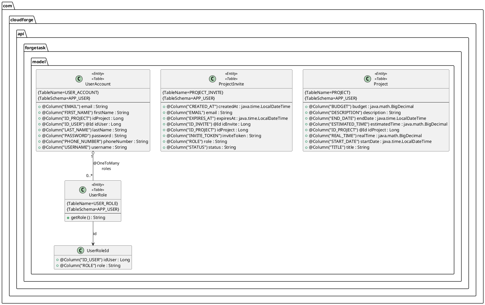
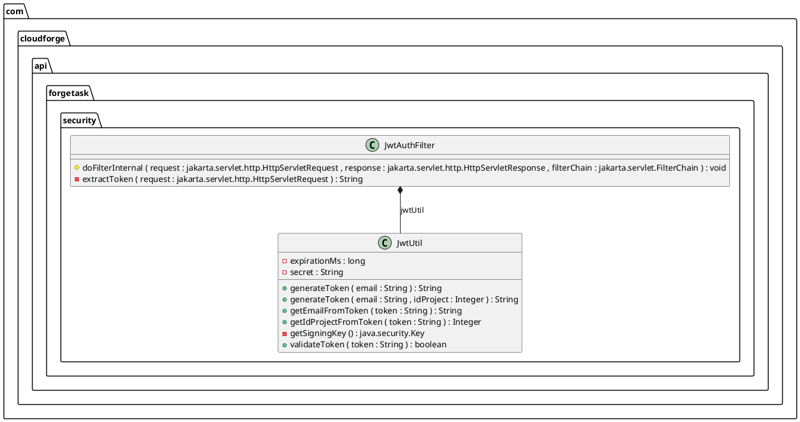
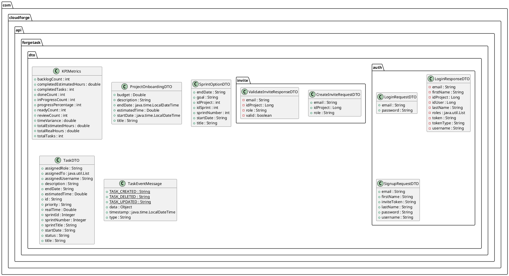

```plantuml
@startuml

class com.cloudforge.api.forgetask.service.KPIService {
	{field} -jdbcTemplate : org.springframework.jdbc.core.JdbcTemplate
	{method} +calculateKPIs ( tasks : java.util.List ) : com.cloudforge.api.forgetask.dto.KPIMetrics
	{method} +calculateKPIs ( tasks : java.util.List , expectedTaskCounts : java.util.Map ) : com.cloudforge.api.forgetask.dto.KPIMetrics
	{method} +getProjectKpisSummary ( projectId : Integer ) : com.cloudforge.api.forgetask.dto.ProjectKpisSummaryDTO
	{method} +getRealHoursBySprintUser ( sprintId : Integer ) : java.util.List
	{method} +getRealHoursByUser ( sprintId : Integer ) : java.util.List
	{method} +getRealHoursTasksByUser ( username : String , sprintId : Integer ) : java.util.List
	{method} +getTaskDistributionByStatus ( tasks : java.util.List ) : java.util.Map
	{method} +getTimeMetricsSummary ( tasks : java.util.List ) : java.util.Map
}


class com.cloudforge.api.forgetask.service.LLMService {
	{field} -llmConfig : com.cloudforge.api.forgetask.config.LLMConfig
	{field} {static} -logger : org.slf4j.Logger
	{field} -restTemplate : org.springframework.web.client.RestTemplate
	{method} +generateText ( prompt : String ) : String
	{method} +isConfigured () : boolean
}


class com.cloudforge.api.forgetask.service.PDFGeneratorService {
	{field} {static} -logger : org.slf4j.Logger
	{method} +generateFilename ( projectId : Integer , sprintId : Integer ) : String
	{method} +generatePDF ( reportContent : String , projectId : Integer , sprintId : Integer ) : [B
	{method} +generatePDF ( reportContent : String , projectId : Integer , sprintId : Integer , metrics : java.util.Map , userHours : java.util.List ) : [B
}


class com.cloudforge.api.forgetask.service.ReportGeneratorService {
	{field} {static} -logger : org.slf4j.Logger
	{method} +generateManagementReport ( projectId : Integer , sprintId : Integer , tasks : java.util.List ) : String
	{method} +generateManagementReport ( projectId : Integer , sprintId : Integer , tasks : java.util.List , userHours : java.util.List ) : String
}


class com.cloudforge.api.forgetask.service.SprintChunkBuilder {
	{field} -jdbcTemplate : org.springframework.jdbc.core.JdbcTemplate
	{field} {static} -logger : org.slf4j.Logger
	{method} +buildSprintChunk ( idSprint : int ) : String
}


class com.cloudforge.api.forgetask.service.SprintEmbeddingService {
	{field} -jdbcTemplate : org.springframework.jdbc.core.JdbcTemplate
	{field} {static} -logger : org.slf4j.Logger
	{method} +indexSprint ( idSprint : int , idProject : int , sprintTitle : String ) : void
}


class com.cloudforge.api.forgetask.service.TelegramReportService {
	{field} {static} -logger : org.slf4j.Logger
	{field} -sprintController : com.cloudforge.api.forgetask.controller.SprintController
	{field} -taskController : com.cloudforge.api.forgetask.controller.TaskController
	{method} +generateAndSendReport ( chatId : long , projectId : Integer , sprintId : Integer , telegramClient : org.telegram.telegrambots.meta.generics.TelegramClient ) : void
}


class com.cloudforge.api.forgetask.service.VectorContextRetriever {
	{field} -jdbcTemplate : org.springframework.jdbc.core.JdbcTemplate
	{field} {static} -logger : org.slf4j.Logger
	{field} -topK : int
	{method} +retrieveSprintContext ( queryText : String , excludeSprintId : int , idProject : int ) : java.util.List
}


class com.cloudforge.api.forgetask.service.auth.AuthService {
	{field} -jwtUtil : com.cloudforge.api.forgetask.security.JwtUtil
	{field} -passwordEncoder : org.springframework.security.crypto.password.PasswordEncoder
	{field} -projectRepository : com.cloudforge.api.forgetask.repository.ProjectRepository
	{field} -userRepo : com.cloudforge.api.forgetask.repository.UserAccountRepository
	{field} -userRoleRepository : com.cloudforge.api.forgetask.repository.UserRoleRepository
	{method} +login ( request : com.cloudforge.api.forgetask.dto.auth.LoginRequestDTO ) : com.cloudforge.api.forgetask.dto.auth.LoginResponseDTO
	{method} +signup ( request : com.cloudforge.api.forgetask.dto.auth.SignupRequestDTO ) : com.cloudforge.api.forgetask.dto.auth.LoginResponseDTO
}


class com.cloudforge.api.forgetask.service.invite.InviteService {
	{field} -inviteRepo : com.cloudforge.api.forgetask.repository.ProjectInviteRepository
	{method} +consumeInvite ( token : String ) : com.cloudforge.api.forgetask.model.ProjectInvite
	{method} +createInvite ( request : com.cloudforge.api.forgetask.dto.invite.CreateInviteRequestDTO ) : String
	{method} +validateToken ( token : String ) : com.cloudforge.api.forgetask.dto.invite.ValidateInviteResponseDTO
}

com.cloudforge.api.forgetask.service.ReportGeneratorService *--  com.cloudforge.api.forgetask.service.KPIService : kpiService
com.cloudforge.api.forgetask.service.ReportGeneratorService *--  com.cloudforge.api.forgetask.service.LLMService : llmService
com.cloudforge.api.forgetask.service.SprintEmbeddingService *--  com.cloudforge.api.forgetask.service.SprintChunkBuilder : chunkBuilder
com.cloudforge.api.forgetask.service.TelegramReportService *--  com.cloudforge.api.forgetask.service.PDFGeneratorService : pdfGeneratorService
com.cloudforge.api.forgetask.service.TelegramReportService *--  com.cloudforge.api.forgetask.service.ReportGeneratorService : reportGeneratorService
com.cloudforge.api.forgetask.service.auth.AuthService *--  com.cloudforge.api.forgetask.service.invite.InviteService : inviteService

@enduml
```

# C4 Level 4 — Code Diagrams

Diagramas de clases generados automáticamente desde el código fuente Java del backend de **Forgetask**.  
Generados por el plugin `plantuml-generator-maven-plugin` vía GitHub Actions en cada push a `main`.

> **Para visualizar los diagramas:** Instala la extensión [PlantUML for GitHub](https://chromewebstore.google.com/detail/plantuml-for-github) en Chrome o Firefox. Los bloques de código se renderizarán automáticamente al abrir esta página.

---

## 1. Controllers — REST Endpoints

Clases que exponen los endpoints HTTP de la API. Cada controller recibe las peticiones del frontend, valida la entrada y delega la lógica al Service correspondiente.

```plantuml
@startuml

class com.cloudforge.api.forgetask.controller.AuthController {
	{field} -authService : com.cloudforge.api.forgetask.service.auth.AuthService
	{method} +login ( request : com.cloudforge.api.forgetask.dto.auth.LoginRequestDTO ) : org.springframework.http.ResponseEntity
	{method} +signup ( request : com.cloudforge.api.forgetask.dto.auth.SignupRequestDTO ) : org.springframework.http.ResponseEntity
}


class com.cloudforge.api.forgetask.controller.InviteController {
	{field} -inviteService : com.cloudforge.api.forgetask.service.invite.InviteService
	{method} +createInvite ( request : com.cloudforge.api.forgetask.dto.invite.CreateInviteRequestDTO ) : org.springframework.http.ResponseEntity
	{method} +validateInvite ( token : String ) : org.springframework.http.ResponseEntity
}


class com.cloudforge.api.forgetask.controller.KPIController {
	{field} -kpiService : com.cloudforge.api.forgetask.service.KPIService
	{method} +calculateKPIs ( request : com.cloudforge.api.forgetask.controller.KPIController$KPICalculationRequest ) : org.springframework.http.ResponseEntity
	{method} +calculateKPIsSimple ( tasks : java.util.List ) : org.springframework.http.ResponseEntity
	{method} +getProjectKpisSummary ( projectId : Integer ) : org.springframework.http.ResponseEntity
	{method} +getRealHoursBySprintUser ( sprintId : Integer ) : org.springframework.http.ResponseEntity
	{method} +getRealHoursByUser ( sprintId : Integer ) : org.springframework.http.ResponseEntity
	{method} +getRealHoursTasksByUser ( username : String , sprintId : Integer ) : org.springframework.http.ResponseEntity
	{method} +getTaskDistribution ( tasks : java.util.List ) : org.springframework.http.ResponseEntity
	{method} +getTimeSummary ( tasks : java.util.List ) : org.springframework.http.ResponseEntity
	{method} +health () : org.springframework.http.ResponseEntity
}


class com.cloudforge.api.forgetask.controller.KPIController$KPICalculationRequest {
	{field} +expectedTaskCounts : java.util.Map
	{field} +tasks : java.util.List
}


class com.cloudforge.api.forgetask.controller.MetricsController {
	{field} {static} -SPRINT_DONE_BY_USER_SQL : String
	{field} -jdbcTemplate : org.springframework.jdbc.core.JdbcTemplate
	{method} -buildDisplayName ( firstName : String , lastName : String , username : String , idUser : int ) : String
	{method} +getTasksDoneByUserInSprint ( sprintId : int ) : java.util.List
}


class com.cloudforge.api.forgetask.controller.ProjectController {
	{field} -jdbcTemplate : org.springframework.jdbc.core.JdbcTemplate
	{field} -projectRepository : com.cloudforge.api.forgetask.repository.ProjectRepository
	{method} +completeOnboarding ( id : Long , dto : com.cloudforge.api.forgetask.dto.ProjectOnboardingDTO ) : org.springframework.http.ResponseEntity
	{method} +listProjects () : java.util.List
}


class com.cloudforge.api.forgetask.controller.ReportController {
	{field} -kpiService : com.cloudforge.api.forgetask.service.KPIService
	{field} -llmService : com.cloudforge.api.forgetask.service.LLMService
	{field} {static} -logger : org.slf4j.Logger
	{field} -pdfGeneratorService : com.cloudforge.api.forgetask.service.PDFGeneratorService
	{field} -reportGeneratorService : com.cloudforge.api.forgetask.service.ReportGeneratorService
	{field} -telegramClient : org.telegram.telegrambots.meta.generics.TelegramClient
	{field} -telegramReportService : com.cloudforge.api.forgetask.service.TelegramReportService
	{method} +generateHTMLReport ( projectId : Integer , sprintId : Integer ) : org.springframework.http.ResponseEntity
	{method} +generatePDFReport ( projectId : Integer , sprintId : Integer ) : org.springframework.http.ResponseEntity
	{method} +generateTextReport ( projectId : Integer , sprintId : Integer ) : org.springframework.http.ResponseEntity
	{method} +getTelegramCurrentSprintContext ( projectId : Integer ) : org.springframework.http.ResponseEntity
	{method} +health () : org.springframework.http.ResponseEntity
	{method} +sendTelegramCurrentSprintReport ( chatId : long , projectId : Integer ) : org.springframework.http.ResponseEntity
}


class com.cloudforge.api.forgetask.controller.SprintController {
	{field} -jdbcTemplate : org.springframework.jdbc.core.JdbcTemplate
	{method} +createSprint ( request : com.cloudforge.api.forgetask.controller.SprintController$SprintCreateRequest ) : org.springframework.http.ResponseEntity
	{method} +deleteSprint ( sprintId : int ) : org.springframework.http.ResponseEntity
	{method} +getCurrentSprint ( projectId : Integer ) : org.springframework.http.ResponseEntity
	{method} +listSprints ( projectId : Integer ) : java.util.List
	{method} +updateSprint ( sprintId : int , request : com.cloudforge.api.forgetask.controller.SprintController$SprintUpdateRequest ) : org.springframework.http.ResponseEntity
}


class com.cloudforge.api.forgetask.controller.SprintController$SprintCreateRequest {
	{field} +endDate : String
	{field} +goal : String
	{field} +projectId : Integer
	{field} +sprintNumber : Integer
	{field} +startDate : String
	{field} +title : String
}


class com.cloudforge.api.forgetask.controller.SprintController$SprintUpdateRequest {
	{field} +endDate : String
	{field} +goal : String
	{field} +projectId : Integer
	{field} +sprintNumber : Integer
	{field} +startDate : String
	{field} +title : String
}


class com.cloudforge.api.forgetask.controller.TaskController {
	{field} -jdbcTemplate : org.springframework.jdbc.core.JdbcTemplate
	{field} -jwtUtil : com.cloudforge.api.forgetask.security.JwtUtil
	{method} +createTask ( task : com.cloudforge.api.forgetask.dto.TaskDTO ) : org.springframework.http.ResponseEntity
	{method} +deleteTask ( id : String ) : org.springframework.http.ResponseEntity
	{method} +getAllTasks () : org.springframework.http.ResponseEntity
	{method} +getProjectUsers ( projectId : Integer ) : org.springframework.http.ResponseEntity
	{method} +getTaskById ( id : String ) : org.springframework.http.ResponseEntity
	{method} +getTasksByProjectAndSprint ( projectId : int , sprintId : int ) : org.springframework.http.ResponseEntity
	{method} +getTasksByProjectFromToken ( request : jakarta.servlet.http.HttpServletRequest ) : org.springframework.http.ResponseEntity
	{method} +updateTask ( id : String , task : com.cloudforge.api.forgetask.dto.TaskDTO ) : org.springframework.http.ResponseEntity
}


class com.cloudforge.api.forgetask.controller.TaskWebSocketController {
	{field} {static} -log : org.slf4j.Logger
	{field} -messagingTemplate : org.springframework.messaging.simp.SimpMessagingTemplate
	{method} +handleTaskCreate ( message : com.cloudforge.api.forgetask.dto.TaskCreateMessage ) : void
	{method} +handleTaskDelete ( message : com.cloudforge.api.forgetask.dto.TaskDeleteMessage ) : void
	{method} +handleTaskUpdate ( message : com.cloudforge.api.forgetask.dto.TaskUpdateMessage ) : void
}


class com.cloudforge.api.forgetask.controller.TelegramBotController {
	{field} -conversationManager : com.cloudforge.api.forgetask.util.ConversationManager
	{field} {static} -logger : org.slf4j.Logger
	{field} -telegramBotConfig : com.cloudforge.api.forgetask.config.TelegramBotConfig
	{field} -telegramClient : org.telegram.telegrambots.meta.generics.TelegramClient
	{field} -telegramReportService : com.cloudforge.api.forgetask.service.TelegramReportService
	{method} +consume ( update : org.telegram.telegrambots.meta.api.objects.Update ) : void
	{method} +getBotToken () : String
	{method} +getUpdatesConsumer () : org.telegram.telegrambots.longpolling.interfaces.LongPollingUpdateConsumer
}

com.cloudforge.api.forgetask.controller.ReportController *--  com.cloudforge.api.forgetask.controller.SprintController : sprintController
com.cloudforge.api.forgetask.controller.ReportController *--  com.cloudforge.api.forgetask.controller.TaskController : taskController
com.cloudforge.api.forgetask.controller.TaskWebSocketController -->  com.cloudforge.api.forgetask.controller.TaskController : taskController
com.cloudforge.api.forgetask.controller.TelegramBotController *--  com.cloudforge.api.forgetask.controller.SprintController : sprintController
com.cloudforge.api.forgetask.controller.TelegramBotController *--  com.cloudforge.api.forgetask.controller.TaskController : taskController

@enduml
```

---

## 2. Services — Business Logic

Clases que contienen la lógica de negocio. Orquestan operaciones, validan reglas y coordinan con los repositorios de datos.

---

## 3. Models — JPA Entities

Entidades JPA que representan las tablas de Oracle DB. Muestran la estructura de datos persistida, columnas y relaciones entre entidades.

---

## 4. Security — JWT Authentication

Clases que implementan la autenticación mediante JWT. `JwtAuthFilter` intercepta cada request HTTP y valida el token. `JwtUtil` genera y verifica los tokens.

---

## 5. DTOs — Data Transfer Objects

Clases que definen el contrato de la API: la forma exacta de los datos que viajan entre el frontend y el backend en cada request y response.

