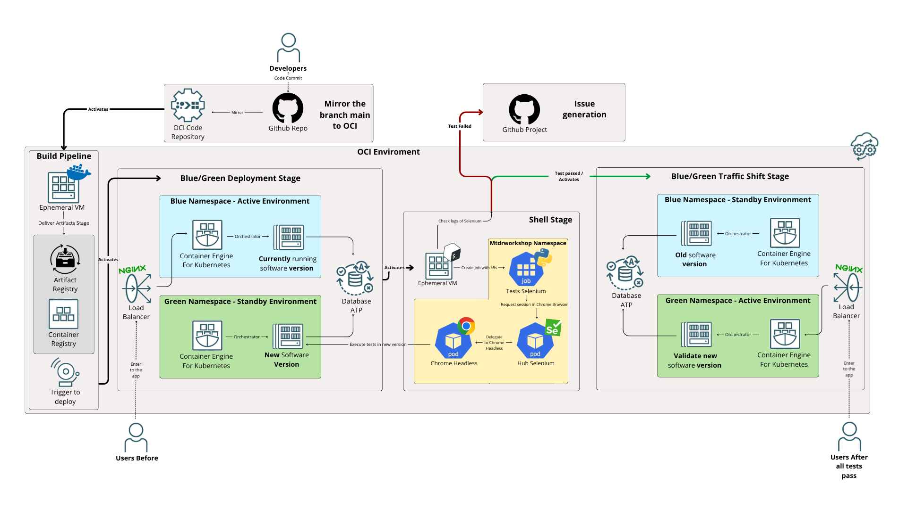

# ForgeTask OCI CI/CD Pipeline Architecture

 

This document describes the complete Continuous Integration and Continuous Deployment (CI/CD) pipeline implemented in Oracle Cloud Infrastructure (OCI) DevOps to safely deploy the application using an automated Blue/Green deployment strategy.

## 📌 Pipeline Overview

The pipeline strictly follows a zero-downtime deployment flow using Oracle Kubernetes Engine (OKE). The flow consists of four primary stages:
1. **Build Pipeline:** Code is mirrored from GitHub. An ephemeral VM builds Docker artifacts and pushes them to OCIR.
2. **Blue/Green Deployment:** The new version is deployed to a standby namespace (Green or Blue) without receiving live traffic.
3. **Automated Testing (Shell Stage):** Integration and E2E tests are executed inside the cluster against the standby environment. If tests fail, an issue is generated in the GitHub Project automatically.
4. **Blue/Green Traffic Shift:** If tests pass, NGINX Ingress rules are updated to route live traffic to the new setup.

---

## 🛠 Stage 1: Build Pipeline

**Triggered by:** A mirror sync caused by a commit to the `main` branch on GitHub.
**Executor:** OCI Ephemeral VM.

### Managed Files
* `build_spec.yaml`: The main OCI DevOps build specification entry point. It sets up environment variables (like `BUILDRUN_HASH` as the version identifier), calls the build script, packages the test shell assets (`shell-assets.zip`), and registers output artifacts.
* `infrastructure/scripts/deploy/ci-build.sh`: Executed by `build_spec.yaml`. It performs parallel/sequential docker builds for the Backend (`forgetask`), Frontend (`forgetask-frontend`), and E2E Tests (`forgetask-e2e-tests`). It then pushes these artifacts to the Oracle Container Registry (OCIR) with their corresponding version tags.

---

## 🟢 🔵 Stage 2: Blue/Green Deployment Stage

**Executor:** OCI DevOps Deployment Pipeline.

In this stage, the newly pushed container images are applied to the Kubernetes Cluster (OKE). OCI DevOps dynamically detects the currently active namespace (say, `ns-blue`) and provisions the new workloads in the standby namespace (say, `ns-green`).

### Managed Files
* `oci-oke-deployment.yaml`: K8s Manifest containing the Backend Deployment, Backend Service, Frontend Deployment, and Frontend Service. Most importantly, it updates the deployments using the `${BUILDRUN_HASH}` injected by OCI artifacts, deploying them to the standby environment. It also handles the configuration for the NGINX tracking traffic.

---

## 🧪 Stage 3: Shell Stage (Automated Quality Gate & E2E)

**Executor:** OCI Ephemeral VM interacting with OKE.

Before any real user traffic is routed to the new deployment, a suite of automated Selenium E2E tests executes against the standby namespace. 

### Managed Files
* `infrastructure/shell/scripts/e2e-run.sh`: 
  Detects which namespace represents the "Target" (standby/new version). It waits for the Deployments to roll out. Then, it interpolates configuration into a Job YAML and launches the tests in a dedicated namespace (`mtdrworkshop`).
* `infrastructure/shell/templates/e2e-job.yaml.tpl`:
  Creates the transient K8s Job that uses the `forgetask-e2e-tests` Docker image. It wires up secrets (emails, GitHub tokens) and internal DNS URLs (`forgetask-frontend-service.${TARGET_NAMESPACE}.svc.cluster.local`) targeting the standby setup.
* `Dockerfile.tests`:
  The container definition for the Python/Pytest runner holding the E2E tests. It runs validation scripts (`wait_for_url.py`) and executes Pytest with the JSON report formatter.
* `infrastructure/kubernetes/templates/selenium-grid.yaml`:
  Contains the `selenium-hub` and `selenium-chrome-node` K8s workloads deployed manually once in the `mtdrworkshop` namespace. The pytest runner routes browser actions silently through this in-cluster grid.
* `infrastructure/shell/scripts/report_failed_tests.py`:
  Automatic Issue Backlog creation. If `e2e-run.sh` detects a failure in the Job, it executes this Python script. It parses the pytest JSON logs and communicates via GraphQL/REST arrays to automatically create a GitHub Issue detailing the failed tests and assigns it directly to the designated GitHub Project V2 board.

---

## 🔀 Stage 4: Blue/Green Traffic Shift Stage

**Executor:** OCI DevOps Deployment Pipeline.

Once the Shell Stage successfully completes (tests exit with code 0), OCI DevOps proceeds to shift traffic.
It patches the cluster's main NGINX Ingress rules so the external load balancer starts redirecting live user traffic away from the "Old" namespace into the "New" namespace. The old namespace becomes the new standby for subsequent rollbacks or future deployments.