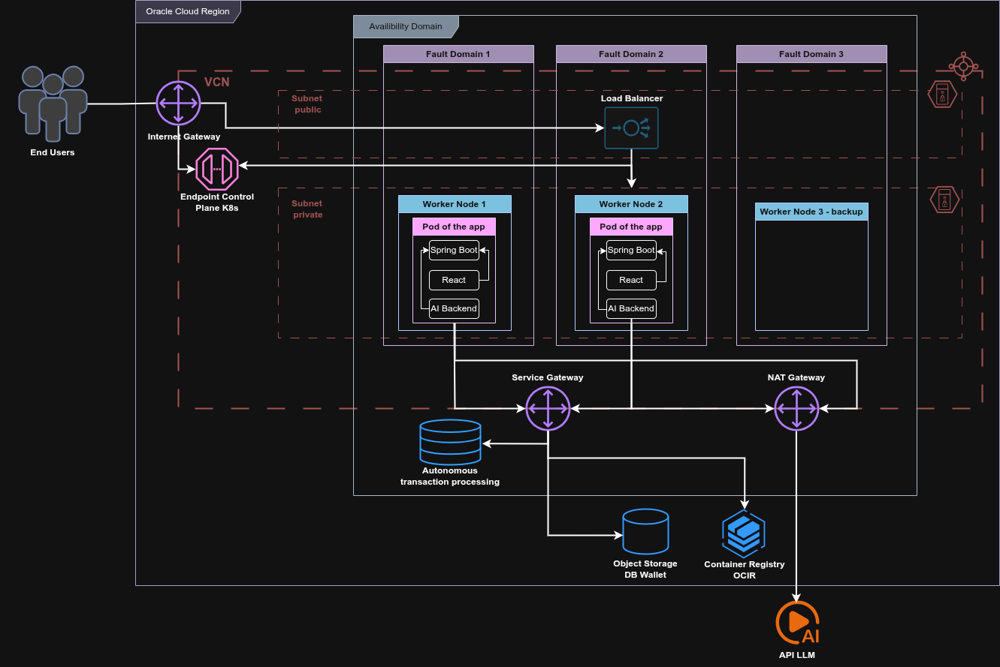

# Infraestructura — MTDR Workshop

Este directorio contiene **todo lo necesario para desplegar la aplicación MTDR
en Oracle Cloud Infrastructure (OCI)**: desde la creación de red y clúster
Kubernetes hasta el despliegue del backend Spring Boot con el frontend React.

La infraestructura se divide en tres responsabilidades independientes:

| Carpeta | Responsabilidad | README |
|---|---|---|
| [`terraform/`](./terraform/) | Crear y destruir los recursos OCI (VCN, OKE, ATP, OCIR) | [`terraform/README.md`](./terraform/README.md) |
| [`scripts/`](./scripts/) | Operar el ciclo de vida del entorno (setup, deploy, destroy) | [`scripts/README.md`](./scripts/README.md) |
| [`kubernetes/`](./kubernetes/) | Definir cómo corre la aplicación en Kubernetes | [`kubernetes/README.md`](./kubernetes/README.md) |

> 📐 Para entender a fondo qué se crea y cómo interactúa cada pieza, ver:
> [`ARQUITECTURA_DEPLOY_OCI.md`](../ARQUITECTURA_DEPLOY_OCI.md)

---

## Arquitectura Cloud Native con el cógido en la carpeta

```
                    Internet
                       │
                       ▼
┌──────────────── OCI Region ─────────────────────────────────┐
│                                                              │
│  ┌──────────────── VCN 10.0.0.0/16 ───────────────────────┐ │
│  │                                                          │ │
│  │  Subred Pública — Load Balancer (10.0.20.0/24)          │ │
│  │  ┌─────────────────────────────────────┐                │ │
│  │  │  OCI Load Balancer  IP Pública :80  │                │ │
│  │  └────────────────────┬────────────────┘                │ │
│  │                       │ :8080                           │ │
│  │  Subred Privada — Worker Nodes (10.0.10.0/24)           │ │
│  │  ┌──────────────┐  ┌──────────────┐  ┌──────────────┐  │ │
│  │  │  Worker 1    │  │  Worker 2    │  │  Worker 3    │  │ │
│  │  │  FD1         │  │  FD2         │  │  FD3 backup  │  │ │
│  │  │  ┌─── POD ─┐ │  │  ┌─── POD ─┐ │  │  (sin pod)  │  │ │
│  │  │  │Spring   │ │  │  │Spring   │ │  │              │  │ │
│  │  │  │Boot +   │ │  │  │Boot +   │ │  │              │  │ │
│  │  │  │React +  │ │  │  │React +  │ │  │              │  │ │
│  │  │  │Telegram │ │  │  │Telegram │ │  │              │  │ │
│  │  │  │:8080    │ │  │  │:8080    │ │  │              │  │ │
│  │  │  └─────────┘ │  │  └─────────┘ │  │              │  │ │
│  │  └──────────────┘  └──────────────┘  └──────────────┘  │ │
│  │                           │ Service Gateway              │ │
│  │  ┌────────────────────────▼─────────────────────────┐   │ │
│  │  │  Oracle ATP Free Tier (MTDRDB)                    │   │ │
│  │  │  Tabla: TODOITEM  │  Tabla: USERS                 │   │ │
│  │  └───────────────────────────────────────────────────┘   │ │
│  │                                                           │ │
│  │  ┌──────────────────────┐   ┌────────────────────────┐   │ │
│  │  │ OCIR (Container Reg) │   │ Object Storage (Bucket) │   │ │
│  │  │ todolistapp-sb:0.1   │   │ wallet de conexión ATP  │   │ │
│  │  └──────────────────────┘   └────────────────────────┘   │ │
│  └──────────────────────────────────────────────────────────┘ │
└──────────────────────────────────────────────────────────────┘
```

## Arquitectura Cloud Native esperado para implementarse final (aun no implementado)


Cada Pod contiene la aplicación completa compilada en un único JAR:
**Spring Boot** (REST API + Telegram Bot Long Polling + DeepSeek LLM client)
+ **React** (frontend compilado como estáticos servidos por Tomcat en `/static`).

> 📐 Diagrama completo con flujos de red, Security Lists y puertos:
> [`ARQUITECTURA_DEPLOY_OCI.md`](../ARQUITECTURA_DEPLOY_OCI.md)

---

## Recursos creados

Terraform crea todos estos recursos de OCI:

| Recurso | Archivo | Descripción |
|---|---|---|
| **VCN** | [`terraform/core.tf`](./terraform/core.tf) | Red virtual 10.0.0.0/16 |
| **Subred Endpoint** | [`terraform/core.tf`](./terraform/core.tf) | Pública 10.0.0.0/28 — API K8s |
| **Subred Node Pool** | [`terraform/core.tf`](./terraform/core.tf) | Privada 10.0.10.0/24 — Worker Nodes |
| **Subred Service LB** | [`terraform/core.tf`](./terraform/core.tf) | Pública 10.0.20.0/24 — Load Balancer |
| **Internet Gateway** | [`terraform/core.tf`](./terraform/core.tf) | Entrada/salida de internet |
| **NAT Gateway** | [`terraform/core.tf`](./terraform/core.tf) | Salida a internet para nodos privados |
| **Service Gateway** | [`terraform/core.tf`](./terraform/core.tf) | Acceso interno a ATP sin salir de OCI |
| **OKE Cluster** | [`terraform/containerengine.tf`](./terraform/containerengine.tf) | K8s v1.34.2, endpoint público |
| **Node Pool** | [`terraform/containerengine.tf`](./terraform/containerengine.tf) | 3× VM.Standard.E3.Flex (2 OCPU, 6 GB RAM) |
| **Oracle ATP** | [`terraform/database.tf`](./terraform/database.tf) | Free Tier, 1 OCPU, 1 TB, OLTP |
| **OCIR Repository** | [`terraform/repositories.tf`](./terraform/repositories.tf) | Registry para la imagen Docker |
| **Object Storage** | [`terraform/object_storage.tf`](./terraform/object_storage.tf) | Bucket para el wallet de ATP |

Los scripts crean adicionalmente estos recursos de Kubernetes y Oracle:

| Recurso | Script | Descripción |
|---|---|---|
| Namespace `mtdrworkshop` | [`scripts/utils/oke-setup.sh`](./scripts/utils/oke-setup.sh) | Namespace K8s de la app |
| Secret `db-wallet-secret` | [`scripts/utils/db-setup.sh`](./scripts/utils/db-setup.sh) | Wallet de conexión a ATP |
| Secret `dbuser` | [`scripts/utils/main-setup.sh`](./scripts/utils/main-setup.sh) | Contraseña de BD |
| Secret `frontendadmin` | [`scripts/utils/main-setup.sh`](./scripts/utils/main-setup.sh) | Contraseña de la UI |
| Deployment + 2 Pods | [`scripts/deploy/deploy.sh`](./scripts/deploy/deploy.sh) | App corriendo en OKE |
| Service LoadBalancer | [`scripts/deploy/deploy.sh`](./scripts/deploy/deploy.sh) | IP pública de la app |
| Usuario `TODOUSER` + Tablas | [`scripts/utils/db-setup.sh`](./scripts/utils/db-setup.sh) | Esquema Oracle ATP |

> 📐 Tabla completa con specs y tipos de cada recurso:
> [`ARQUITECTURA_DEPLOY_OCI.md — Sección 10`](../ARQUITECTURA_DEPLOY_OCI.md#10-resumen-de-todos-los-recursos-oci-creados-por-terraform)

---

## Estructura de archivos

```text
infrastructure/
│
├── README.md                         ← Este archivo
│
├── terraform/                        ← Infraestructura como código
│   ├── README.md
│   ├── provider.tf                   ← Proveedor OCI y región
│   ├── availability_domain.tf        ← Selección del AD en la región
│   ├── core.tf                       ← VCN, subnets, gateways, routing, security lists
│   ├── containerengine.tf            ← Clúster OKE + node pool (3 nodos)
│   ├── database.tf                   ← Oracle Autonomous DB ATP Free Tier
│   ├── repositories.tf               ← Container Registry OCIR
│   ├── object_storage.tf             ← Bucket para el wallet de ATP
│   ├── apigateway.tf                 ← API Gateway (desactivado/comentado)
│   ├── main-var.tf                   ← Variables de entrada del módulo
│   └── outputs.tf                    ← Valores exportados tras terraform apply
│
├── scripts/                          ← Operación del entorno
│   ├── README.md
│   ├── env.sh                        ← (1) SIEMPRE ejecutar primero con source
│   ├── setup.sh                      ← (2) Aprovisiona toda la infraestructura
│   ├── destroy.sh                    ← (3) Destruye toda la infraestructura
│   │
│   ├── deploy/                       ← Iteración diaria: build y redeploy de la app
│   │   ├── README.md
│   │   ├── build.sh                  ← Compila JAR + construye imagen Docker + push OCIR
│   │   └── deploy.sh                 ← Procesa manifest y aplica kubectl apply
│   │
│   └── utils/                        ← Orquestadores internos (no ejecutar directamente)
│       ├── README.md
│       ├── state-functions.sh        ← Motor de hitos reanudables (núcleo del sistema)
│       ├── main-setup.sh             ← Pipeline de 5 fases del aprovisionamiento
│       ├── main-destroy.sh           ← Pipeline del teardown
│       ├── terraform.sh              ← Wrapper de terraform apply/destroy
│       ├── java-builds.sh            ← Build Maven + Docker en background
│       ├── oke-setup.sh              ← Configura kubectl → OKE
│       ├── db-setup.sh               ← Wallet ATP + Kubernetes Secrets
│       ├── kube_token_cache.sh       ← Refresca token de kubectl
│       ├── lb-destroy.sh             ← Elimina Load Balancer (fuera de Terraform)
│       ├── os-destroy.sh             ← Vacía Object Storage antes del destroy
│       ├── repo-destroy.sh           ← Limpia imágenes Docker antes del destroy
│       └── python/
│           ├── generate-unique-key.py          ← ID único del entorno
│           └── process-cluster-ocid-json.py    ← Extrae OCID del clúster OKE
│
└── kubernetes/                       ← Manifests de Kubernetes
    ├── README.md
    ├── templates/
    │   └── todolistapp-springboot.yaml   ← Deployment + Service (con placeholders)
    └── generated/
        └── .gitignore                    ← YAMLs procesados (no se versionan)
```

---

## Prerrequisitos en OCI

Completar estos 4 pasos **una sola vez** en la consola web de OCI antes
de cualquier comando.

### 1 — Cuenta de Oracle Cloud

Verificar acceso activo en: https://www.oracle.com/cloud/

---

### 2 — Crear OCI Group

En OCI Console → **Identity & Security → Domains → Default Domain → Groups**:

Crear un grupo llamado `myToDoGroup` y agregar tu usuario al grupo.

---

### 3 — Crear Políticas de Acceso

En OCI Console → **Identity & Security → Policies → Create Policy**:

Activar **"Show manual editor"** y pegar exactamente:

```
Allow group myToDoGroup to use cloud-shell in tenancy
Allow group myToDoGroup to manage users in tenancy
Allow group myToDoGroup to manage all-resources in tenancy
Allow group myToDoGroup to manage buckets in tenancy
Allow group myToDoGroup to manage objects in tenancy
```

---

### 4 — Cloud Shell en arquitectura x86

En OCI Console → ícono **Cloud Shell** (esquina superior derecha):

1. Abrir Cloud Shell
2. Clic en **Actions** en la barra verde inferior
3. Clic en **Architecture**
4. Seleccionar **X86_64**
5. Clic en **Confirm**

> ⚠️ Usar ARM causa fallos en el build de Maven. X86_64 es obligatorio.

---

## Guía de despliegue completa

### Paso 1 — Clonar el proyecto

Desde Cloud Shell:

```bash
mkdir reacttodo
cd reacttodo
git clone --single-branch https://github.com/<tu-org>/<tu-repo>
```

---

### Paso 2 — Ajustar permisos y cargar entorno

```bash
cd <tu-repo>/infrastructure/scripts
chmod +x *.sh deploy/*.sh utils/*.sh

# Agregar env.sh al shell para que se cargue automáticamente
echo "source $(pwd)/env.sh" >> ~/.bashrc
```

Cerrar Cloud Shell y volver a abrirlo. Al reabrir, `env.sh` habrá
configurado automáticamente:

- `JAVA_HOME` → GraalVM 22
- `MTDRWORKSHOP_LOCATION` → ruta raíz del proyecto
- Directorio de estado (`state/`) y logs (`log/`)
- Aliases de productividad: `pods`, `services`, `deployments`, `secrets`

> 📖 Detalle completo de lo que hace `env.sh`:
> [`scripts/README.md`](./scripts/README.md)

---

### Paso 3 — Configurar el token de Telegram

Crear un bot nuevo con **@BotFather** en Telegram y copiar el token.
Luego editarlo en Cloud Shell:

```bash
vi ../backend/src/main/resources/application.properties
```

Dentro del editor vi:
1. Presionar `i` para modo edición
2. Navegar al final y reemplazar los placeholders:

```properties
telegram.bot.token=<TU_TOKEN_AQUI>
telegram.bot.name=<NOMBRE_DE_TU_BOT>
```

3. Presionar `Esc`, luego escribir `:wq` y Enter

---

### Paso 4 — Desplegar la infraestructura

```bash
source setup.sh
```

El setup es **reanudable**: si se interrumpe, volver a ejecutar el mismo
comando para retomar desde el último punto completado.

Durante la ejecución, el script solicita de forma interactiva:

| Dato solicitado | Dónde encontrarlo | Sugerencia |
|---|---|---|
| **OCI User OCID** | OCI Console → Perfil de usuario → OCID | Tu OCID personal |
| **Compartment** | Dejar vacío para usar el compartment raíz | *(Enter vacío)* |
| **DB Password** | Inventar — requisitos abajo | `None00010001` |
| **UI Username** | Para la interfaz web | `admin` |
| **UI Password** | Para la interfaz web | `None0001` |

**Requisitos de la contraseña de BD:**
- 12–30 caracteres
- Al menos 1 mayúscula, 1 minúscula, 1 número
- No puede contener `"admin"` ni comillas dobles

El setup ejecuta en paralelo:

```
[background] terraform.sh      → VCN + OKE + ATP + OCIR + Object Storage
[background] java-builds.sh    → mvn package + docker build + docker push
[background] oke-setup.sh      → kubeconfig + namespace mtdrworkshop
[background] db-setup.sh       → wallet ATP + Kubernetes Secrets
```

Al finalizar correctamente verás:

```
✅ SETUP VERIFIED
```

> 📖 Detalle de cada fase del setup:
> [`scripts/README.md`](./scripts/README.md)
>
> 📐 Qué crea Terraform en detalle:
> [`terraform/README.md`](./terraform/README.md)

---

### Paso 5 — Construir y desplegar la aplicación

Cerrar y reabrir Cloud Shell, luego:

```bash
cd infrastructure/scripts/deploy

# Compilar Spring Boot, construir imagen Docker y publicar en OCIR
./build.sh

# Procesar el manifest de Kubernetes y aplicar en OKE
./deploy.sh
```

> Si durante `build.sh` se pide seleccionar una imagen base de Docker,
> elegir la opción de `docker.io/openjdk`.

**Qué hace `build.sh`:**

```
mvn clean package spring-boot:repackage
    → Compila Java + React (via Maven plugin)
    → Genera MyTodoList.jar (backend + frontend en un único JAR)

docker build -f Dockerfile -t <registry>/todolistapp-springboot:0.1 .
    → Crea la imagen Docker

docker push <imagen>
    → Publica en OCIR
    → Elimina la imagen local si el push fue exitoso
```

**Qué hace `deploy.sh`:**

```
Copia kubernetes/templates/todolistapp-springboot.yaml
    → Sustituye %DOCKER_REGISTRY%, %TODO_PDB_NAME%, %OCI_REGION%, %UI_USERNAME%
    → Genera kubernetes/generated/todolistapp-springboot-<timestamp>.yaml

kubectl apply -f <yaml-generado> -n mtdrworkshop
    → Crea Deployment (2 réplicas distribuidas en Worker Nodes)
    → Crea Service LoadBalancer (OCI aprovisiona IP pública)
```

> 📖 Detalle completo de build y deploy:
> [`scripts/deploy/README.md`](./scripts/deploy/README.md)
>
> 📐 Flujo interno del deploy con diagrama:
> [`ARQUITECTURA_DEPLOY_OCI.md — Sección 8`](../ARQUITECTURA_DEPLOY_OCI.md#8-flujo-completo-del-deploy)
>
> 📄 Manifest de Kubernetes (templates y placeholders):
> [`kubernetes/README.md`](./kubernetes/README.md)

---

### Paso 6 — Verificar el despliegue

```bash
pods        # kubectl get po --all-namespaces
services    # kubectl get services --all-namespaces
```

Esperar hasta ver los pods en estado `Running` y la `EXTERNAL-IP` asignada
(puede tardar 2–5 minutos la primera vez):

```
NAMESPACE       NAME                           READY   STATUS    RESTARTS   AGE
mtdrworkshop    todolistapp-springboot-xxx     1/1     Running   0          3m
mtdrworkshop    todolistapp-springboot-yyy     1/1     Running   0          3m
```

```
NAMESPACE     NAME                              TYPE           EXTERNAL-IP
mtdrworkshop  todolistapp-springboot-service    LoadBalancer   <IP_PUBLICA>
```

---

### Paso 7 — Usar la aplicación

Con la `EXTERNAL-IP` del paso anterior:

- **Frontend web:** `http://<EXTERNAL-IP>/todolist`
- **Bot de Telegram:** buscar el bot por su nombre y enviar `/start`

---

## Iterar sobre el código

Para redesplegar después de cambios en backend o frontend:

```bash
cd infrastructure/scripts/deploy

./build.sh    # Solo si cambió el código fuente
./deploy.sh   # Siempre para actualizar lo que corre en OKE
```

No es necesario repetir los pasos 1–4 mientras la infraestructura esté activa.

---

## Destruir la infraestructura

```bash
cd infrastructure/scripts
source destroy.sh
```

Orden de eliminación:

```
1. repo-destroy.sh    → Vacía el Container Registry (imágenes Docker)
2. os-destroy.sh      → Vacía el Object Storage bucket (wallet)
3. lb-destroy.sh      → Elimina el Load Balancer (fuera de Terraform)
4. terraform destroy  → Elimina VCN, OKE, ATP, OCIR, Object Storage
```

Al finalizar archiva el estado en `toDelete_<timestamp>/`.

> ⚠️ Esta operación es **irreversible**. Todos los datos de la BD y los
> recursos de OCI se eliminarán permanentemente.
>
> Verificar en la consola web de OCI que no quedaron recursos activos
> generando costos antes de eliminar el directorio `toDelete_*`.

---

## Troubleshooting

### `terraform apply` falla con `CompartmentIdNotFound`

El compartment recién creado aún no está activo. El sistema de hitos
retoma automáticamente:

```bash
source setup.sh
```

---

### `terraform apply` falla con `Creating Auth Token had failed`

Hay demasiados Auth Tokens en tu cuenta (máximo 2).
En OCI Console → Perfil → Auth Tokens: eliminar el primer token y reintentar:

```bash
source setup.sh
```

---

### `build.sh` falla con `...not authorized`

El login a OCIR no está vigente. Reconectarse manualmente:

```bash
docker login \
  -u "$(state_get NAMESPACE)/$(state_get USER_NAME)" \
  "$(state_get REGION).ocir.io"
```

---

### Error persistente después de múltiples reintentos

Destruir el entorno completo, reiniciar Cloud Shell y retomar desde el Paso 4:

```bash
source destroy.sh
# Cerrar y reabrir Cloud Shell
source setup.sh
```

---

### `terraform apply` falla en región Monterrey con shape no disponible

Editar el Node Pool para usar un shape disponible:

```bash
vi terraform/containerengine.tf
# Ubicar node_shape y cambiar a:
# node_shape = "VM.Standard.E5.Flex"
```

Luego reintentar:

```bash
source setup.sh
```

---

### Revisar logs de cualquier fase

```bash
tail -f $MTDRWORKSHOP_LOG/terraform.log
tail -f $MTDRWORKSHOP_LOG/java-builds.log
tail -f $MTDRWORKSHOP_LOG/oke-setup.log
tail -f $MTDRWORKSHOP_LOG/db-setup.log
```

---

## Documentación completa

| Documento | Qué cubre |
|---|---|
| [`ARQUITECTURA_DEPLOY_OCI.md`](../ARQUITECTURA_DEPLOY_OCI.md) | Arquitectura detallada: OKE, VCN, ATP, pods, red, flujo de deploy |
| [`terraform/README.md`](./terraform/README.md) | Recursos Terraform, variables, outputs, costos |
| [`scripts/README.md`](./scripts/README.md) | Motor de hitos, env.sh, setup.sh, destroy.sh, aliases |
| [`scripts/utils/README.md`](./scripts/utils/README.md) | Orquestadores internos, fases del setup, logs |
| [`scripts/deploy/README.md`](./scripts/deploy/README.md) | build.sh, deploy.sh, variables requeridas, troubleshooting |
| [`kubernetes/README.md`](./kubernetes/README.md) | Manifests, placeholders, templates vs generated, Load Balancer |